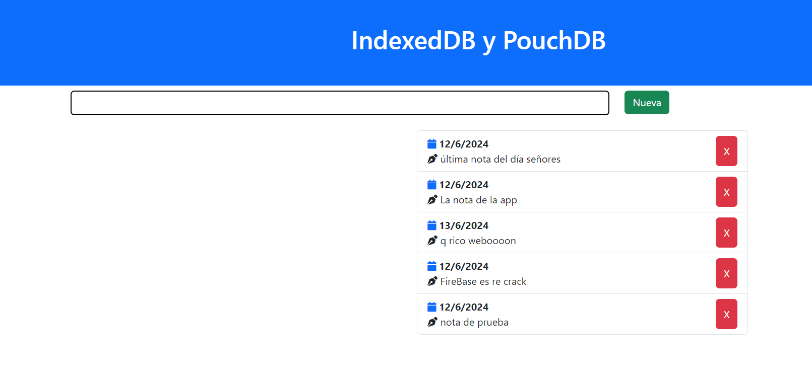

# Aplicación de notas

## Pasos

1° Creo un repositorio

Terminal > git bash
Escribo: git init

2° Configurar el usuario y mail
git config user.name "santiagoprietooo" global
git config user.mail "santiago.prieto@davinci.edu.ar" global

chequeo en: - git config user.name
            - git config user.mail

3° Agrego los archivos
Para agregar uno por uno: git add index.html
Para agregar todos:       git add .

4° Creo el commit
git commit -m "Nombre de los cambios"

Fin